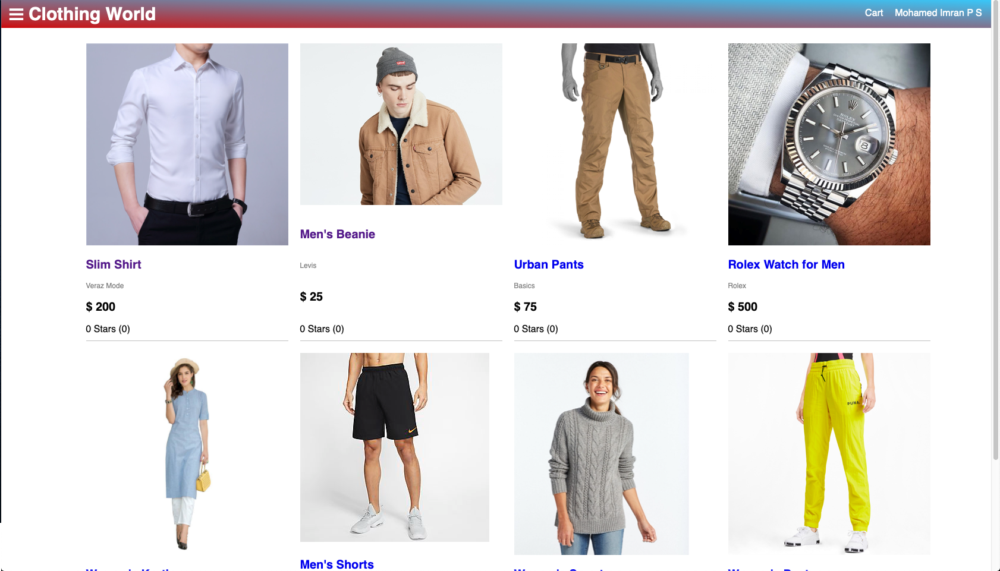
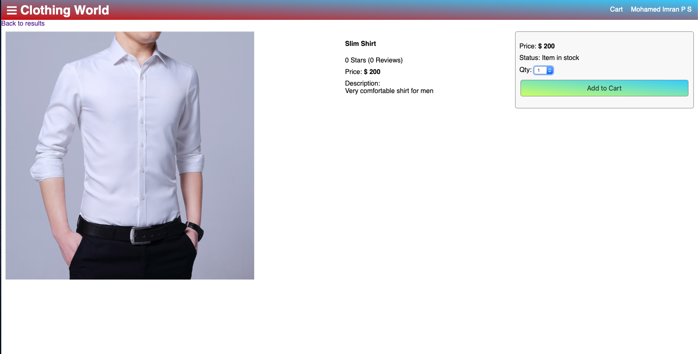
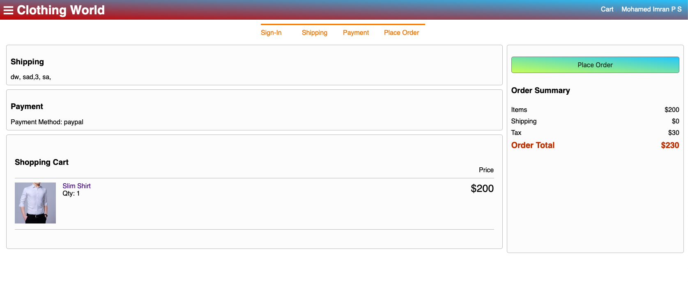

# Clothing-Store-Website-With-React
A fully functioning E-commerce website for clothings built with react

## Packages and Libraries Used
```bash
React
React - Redux
Node 
Express
MongoDB
Mongoose
Babel
```
## Code
Check out the code section for all the code files.

## Run Locally


- git clone https://github.com/Imran109/Clothing-Store-Website-With-React.git

- cd Clothing-Store-Website-With-React

- Run Backend
  - npm install
  - npm start
  
- Run Frontend
  - open new terminal
  - cd frontend
  - npm install
  - npm start

Let me know if you have any questions. [Email Mohamed Imran P S](mailto:mohamedimranps@gmail.com)


## Home Screen


## Product Screen


## Place Order Screen


## Admin Screen


## Admin Products View


More Screenshots can be viewed from the `images` folder.

## Contributing
Pull requests are welcome. For major changes, please open an issue first to discuss what you would like to change.
Please make sure to update tests as appropriate.

## License
[Mohamed Imran P S](https://linkedin.com/in/mohamedimranps)
